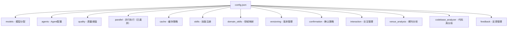

# config.json 配置参考

> **系统中心化配置文件** — 控制模型分配、质量阈值、缓存策略、领域映射、版本管理、交互策略等

---

## 一、配置概览

`config.json` 是论文工厂系统的核心配置文件，通过单文件控制整个论文生成流程的方方面面。



### 配置节速查表

| 配置节 | 作用 | 关键参数 |
|--------|------|----------|
| **models** | 定义推理/写作使用的模型类型 | `reasoning: opus`, `writing: sonnet` |
| **agents** | 10 个 Agent 的模型引用、工具权限、条件执行 | 每个 Agent 可定制模型、工具、激活条件 |
| **quality** | 质量门控阈值 | 最小论文字数、评审分数阈值、章节字数要求 |
| **parallel** | Phase 1 并行执行开关（已废弃） | `phase1_enabled: false (已废弃)` |
| **cache** | 论文缓存策略 | 自动生成索引、过期清理、领域映射 |
| **skills** | Skill 注册表 | 描述与 Skill 文件的映射关系 |
| **domain_skills** | 领域 → 领域知识文档的映射 | 基于 keywords 自动匹配 |
| **versioning** | 版本管理策略 | `mode: milestones`, 最大保留版本数 |
| **confirmation** | 用户确认策略 | `mode: threshold`, 里程碑确认 |
| **interaction** | 交互管理与检查点 | `mode: interactive`, 必选/可选检查点 |
| **venue_analysis** | 期刊/会议分析配置 | 预定义期刊列表、缓存时长 |
| **codebase_analyzer** | 代码库分析工具配置 | 模型选择、可用工具 |
| **feedback** | 人类反馈管理 | 优先级、状态追踪 |

> **会议/期刊配置**：所有目标会议/期刊的配置信息（格式、页数限制、模板等）已从 `config.json` 迁移至项目根目录的 [venues.md](../venues.md) 文件。这是系统唯一的会议/期刊配置源，支持用户自定义添加新会议/期刊。详见 [快速开始指南](getting-started.md#第三步自定义会议期刊配置可选)。

---

## 二、models - 模型分配

定义系统中使用的模型类型，所有 Agent 通过引用这些名称来指定模型。

```json
"models": {
  "reasoning": "opus",
  "writing": "sonnet"
}
```

### 参数说明

| 参数 | 类型 | 默认值 | 说明 |
|------|------|--------|------|
| `reasoning` | string | `"opus"` | 推理类任务使用的模型（文献检索、评审、理论构建） |
| `writing` | string | `"sonnet"` | 写作类任务使用的模型（章节撰写、格式整合） |

### 可用模型

| 模型 | 成本 | 适用场景 |
|------|------|----------|
| `opus` | 高 | 文献检索、同行评审、理论分析 |
| `sonnet` | 中 | 章节撰写、格式整合、图表设计 |

### 修改指南

降低成本时，可将部分推理任务改用 Sonnet：

```json
"models": {
  "reasoning": "sonnet",  // 降低成本，但可能影响质量
  "writing": "sonnet"
}
```

---

## 三、agents - Agent 配置

定义 10 个 Agent 的模型引用、工具权限和条件执行逻辑。

### 配置结构

```json
"agents": {
  "a1": {
    "model": "reasoning",
    "tools": ["WebSearch", "WebFetch", "Read", "Write"]
  }
}
```

### 参数说明

| 参数 | 类型 | 说明 |
|------|------|------|
| `model` | string | 引用 `models` 中定义的模型名称 |
| `tools` | array | Agent 可用的工具列表 |
| `conditional` | boolean | 是否为条件执行 Agent（可选） |
| `condition` | string | 激活条件的描述（可选） |

### 10 个 Agent 配置一览

| Agent | 模型引用 | 核心工具 | 条件执行 |
|-------|----------|----------|----------|
| **A1** 文献调研 | `reasoning` | WebSearch, WebFetch, Read, Write | - |
| **B1** 相关工作 | `reasoning` | Read, Write, WebSearch | - |
| **B2** 实验设计 | `reasoning` | Read, Write, Glob | - |
| **B3** 结构设计 | `reasoning` | Read, Write, Glob | - |
| **C1** 章节撰写 | `writing` | Read, Write | - |
| **C2** 图表设计 | `writing` | Read, Write | - |
| **C3** 格式整合 | `writing` | Read, Write, Glob | - |
| **C4** LaTeX 编译 | `writing` | Read, Write, Bash | - |
| **D1** 同行评审 | `reasoning` | Read, Write | - |
| **D2** 修订执行 | `reasoning` | Read, Write | - |

### 修改示例

为 A1 文献调研降本：

```json
"a1": {
  "model": "writing"  // 从 reasoning 改为 writing
}
```

---

## 四、quality - 质量阈值

定义论文生成过程中的质量门控参数。

```json
"quality": {
  "min_papers": 40,
  "min_review_score": 9.0,
  "max_review_iterations": 15,
  "max_response_rounds": 3,
  "dynamic_scoring": true,
  "required_sections": ["abstract", "introduction", "related_work", "methodology", "experiments", "results", "discussion", "conclusion"],
  "section_min_word_count": {
    "introduction": 800,
    "related_work": 1500,
    "methodology": 1200,
    "experiments": 1000,
    "discussion": 800
  }
}
```

### 参数说明

| 参数 | 类型 | 默认值 | 说明 |
|------|------|--------|------|
| `min_papers` | int | 40 | Phase 1 最小检索论文数量 |
| `min_review_score` | float | 9.0 | 评审通过的最小分数（0-10 分制） |
| `max_review_iterations` | int | 15 | Phase 4 最大评审迭代次数 |
| `max_response_rounds` | int | 3 | 每轮迭代的专家回复轮数 |
| `dynamic_scoring` | boolean | true | 是否启用动态评分 |
| `required_sections` | array | - | 论文必含章节列表 |
| `section_min_word_count` | object | - | 各章节最小字数要求 |

### 章节字数要求

| 章节 | 最小字数 | 说明 |
|------|-----------|------|
| abstract | - | 由论文模板控制 |
| introduction | 800 | 引言 |
| related_work | 1500 | 相关工作（通常最长） |
| methodology | 1200 | 方法论 |
| experiments | 1000 | 实验设计 |
| results | - | 结果分析 |
| discussion | 800 | 讨论 |
| conclusion | - | 结论 |

### 修改指南

**收紧质量标准**（可能增加生成时间和成本）：

```json
"quality": {
  "min_papers": 60,           // 增加到 60 篇
  "min_review_score": 9.5,       // 提高到 9.5 分
  "max_review_iterations": 20     // 允许更多迭代
}
```

**放松质量标准**（加快生成）：

```json
"quality": {
  "min_papers": 30,
  "min_review_score": 8.5,
  "max_review_iterations": 10
}
```

---

## 五、parallel - 并行执行（已废弃）

> **已废弃**：并行模式已移除，Phase 1 现在采用串行执行模式（A1 → B1 → 创新聚合）。此配置节仅为向后兼容保留。

```json
"parallel": {
  "phase1_enabled": false,
  "use_task_tool": true,
  "timeout_per_agent": 300,
  "retry_on_failure": true,
  "max_retries": 1,
  "deprecated": "并行模式已移除，Phase 1 现在只支持串行执行"
}
```

### 参数说明

| 参数 | 类型 | 默认值 | 说明 |
|------|------|--------|------|
| `phase1_enabled` | boolean | false | ~~是否启用 Phase 1 并行模式~~ **已废弃，固定为 false** |
| `use_task_tool` | boolean | true | ~~是否使用 Task 工具实现并行~~ **已废弃** |
| `timeout_per_agent` | int | 300 | 单个 Agent 超时时间（秒） |
| `retry_on_failure` | boolean | true | 失败时是否重试 |
| `max_retries` | int | 1 | 最大重试次数 |
| `deprecated` | string | - | 废弃说明信息 |

---

## 六、cache - 缓存策略

控制论文缓存系统的行为。

```json
"cache": {
  "enabled": true,
  "max_papers_per_domain": 500,
  "purge_after_days": 365,
  "auto_generate_index": true,
  "domains": {
    "multi_agent_systems": "MAS",
    "knowledge_graph": "KG",
    "nlp_to_sql": "NL2SQL",
    "bridge_engineering": "Bridge"
  }
}
```

### 参数说明

| 参数 | 类型 | 默认值 | 说明 |
|------|------|--------|------|
| `enabled` | boolean | true | 是否启用缓存系统 |
| `max_papers_per_domain` | int | 500 | 单领域最大缓存论文数 |
| `purge_after_days` | int | 365 | 缓存过期天数（0 = 不清理） |
| `auto_generate_index` | boolean | true | 是否自动生成索引文件 |
| `domains` | object | - | 领域代码映射表 |

### 领域映射表

| 领域标识 | 代码 | 缓存目录 |
|----------|------|----------|
| `multi_agent_systems` | MAS | `workspace/.cache/papers/MAS/` |
| `knowledge_graph` | KG | `workspace/.cache/papers/KG/` |
| `nlp_to_sql` | NL2SQL | `workspace/.cache/papers/NL2SQL/` |
| `bridge_engineering` | Bridge | `workspace/.cache/papers/Bridge/` |

### 性能收益

| 场景 | 无缓存 | 有缓存 |
|------|--------|--------|
| 首次生成 | 100% | 100% (建立缓存) |
| 第二次生成（同领域） | 100% | **20-40%** |
| 第三次生成（同领域） | 100% | **10-30%** |

---

## 七、skills - 技能注册

系统已安装 Skill 的描述和元数据。

```json
"skills": {
  "paper-generation": { "description": "论文生成主编排器" },
  "paper-phase1-research": { "description": "Phase 1 文献调研与相关工作分析（串行执行）" },
  "paper-phase2-design": { "description": "Phase 2 论文设计阶段（B2 → B3）" },
  "paper-phase3-writing": { "description": "Phase 3 论文撰写阶段" },
  "paper-phase4-quality": { "description": "Phase 4 质量保障阶段" },
  "domain-knowledge-update": { "description": "领域知识动态更新（唯一保留的领域 Skill）" }
}
```

---

## 八、domain_skills - 领域映射

定义领域与领域知识文档的映射关系，用于 Phase 1 理论分析和 Phase 4 动态专家选择。

> 5 个领域知识文件已从 Skill 降级为纯 Markdown 文档（`docs/domain-knowledge/`），Agent 通过 `Read` 工具直接读取。

```json
"domain_skills": {
  "knowledge_graph": {
    "doc": "docs/domain-knowledge/kg.md",
    "full_name": "Knowledge Graphs and Ontology Engineering",
    "keywords": ["KG", "ontology", "RDF", "OWL", "SPARQL", "knowledge graph", "RDFS"]
  },
  "multi_agent_systems": {
    "doc": "docs/domain-knowledge/mas.md",
    "full_name": "Multi-Agent Systems (MAS)",
    "keywords": ["multi-agent", "MAS", "BDI", "Contract Net", "Blackboard", "agent communication", "coordination", "negotiation"]
  },
  "nl2sql": {
    "doc": "docs/domain-knowledge/nl2sql.md",
    "full_name": "Natural Language to SQL (NL2SQL / Text2SQL)",
    "keywords": ["NL2SQL", "Text2SQL", "schema linking", "SQL generation", "text-to-SQL", "natural language interface"]
  },
  "bridge_engineering": {
    "doc": "docs/domain-knowledge/bridge.md",
    "full_name": "Bridge Engineering",
    "keywords": ["bridge", "structural health", "inspection", "BIM", "SHM", "non-destructive testing", "load rating", "damage detection"]
  },
  "data_analysis": {
    "doc": "docs/domain-knowledge/data.md",
    "full_name": "Data Analysis and Machine Learning",
    "keywords": ["data mining", "machine learning", "classification", "regression", "clustering", "feature engineering", "cross-validation"]
  }
}
```

### 参数说明

| 参数 | 类型 | 说明 |
|------|------|------|
| `doc` | string | 对应的领域知识文档路径（`docs/domain-knowledge/*.md`） |
| `full_name` | string | 领域完整名称 |
| `keywords` | array | 匹配关键词列表 |

### 工作原理

- **Phase 1**：编排器根据 `keywords` 识别领域后，启动 DK-Agent 通过 `Read` 读取对应的 `doc` 文档进行理论分析
- **Phase 4**：编排器根据 `keywords` 判断论文所属领域，启动领域评审专家 Agent 读取对应的 `doc` 文档作为评审认知框架

### 新增领域

1. 创建 `docs/domain-knowledge/your-domain.md`（包含理论分析 + 评审认知框架）
2. 在 `domain_skills` 中添加映射：

```json
"domain_skills": {
  "your_new_domain": {
    "doc": "docs/domain-knowledge/your-domain.md",
    "full_name": "Your New Domain Full Name",
    "keywords": ["keyword1", "keyword2", "keyword3"]
  }
}
```

---

## 九、versioning - 版本管理

控制 Phase 4 评审迭代过程中的版本快照与管理策略。

```json
"versioning": {
  "enabled": true,
  "mode": "milestones",
  "max_versions_to_keep": 10,
  "compress_old_versions": false
}
```

### 参数说明

| 参数 | 类型 | 默认值 | 说明 |
|------|------|--------|------|
| `enabled` | boolean | true | 是否启用版本管理 |
| `mode` | string | `"milestones"` | 版本创建模式：`all`（每次迭代）、`milestones`（里程碑时）、`smart`（智能判断）、`off`（关闭） |
| `max_versions_to_keep` | int | 10 | 最大保留版本数 |
| `compress_old_versions` | boolean | false | 是否压缩旧版本以节省空间 |

### 版本模式说明

| 模式 | 行为 | 适用场景 |
|------|------|----------|
| `all` | 每次评审迭代都创建版本快照 | 需要完整审计轨迹 |
| `milestones` | 仅在里程碑节点创建快照（推荐） | 平衡存储与可追溯性 |
| `smart` | 根据变更幅度智能决定是否创建快照 | 自动化管理 |
| `off` | 不创建版本快照 | 节省存储空间 |

---

## 十、confirmation - 确认策略

控制用户确认的触发条件和行为。

```json
"confirmation": {
  "mode": "threshold",
  "threshold_score": 9.0,
  "confirm_at_milestones": true,
  "confirm_every_n_iterations": null,
  "require_approval_for_final": true
}
```

### 参数说明

| 参数 | 类型 | 默认值 | 说明 |
|------|------|--------|------|
| `mode` | string | `"threshold"` | 确认模式：`threshold`（达到阈值时确认）、`always`（每次迭代确认）、`never`（自动通过） |
| `threshold_score` | float | 9.0 | 触发用户确认的评审分数阈值 |
| `confirm_at_milestones` | boolean | true | 是否在里程碑节点请求用户确认 |
| `confirm_every_n_iterations` | int/null | null | 每 N 次迭代请求确认（null = 不按次数确认） |
| `require_approval_for_final` | boolean | true | 最终版本是否需要用户批准 |

---

## 十一、interaction - 交互管理

控制论文生成过程中的用户交互检查点。

```json
"interaction": {
  "mode": "interactive",
  "required_checkpoints": [
    "phase0_venue_selection",
    "phase0_title_confirmation",
    "phase0_abstract_framework",
    "phase2_b3_outline_confirmation"
  ],
  "optional_checkpoints": [],
  "allow_skip_optional": true,
  "feedback_persistence": true,
  "auto_apply_feedback": true
}
```

### 参数说明

| 参数 | 类型 | 默认值 | 说明 |
|------|------|--------|------|
| `mode` | string | `"interactive"` | 交互模式：`interactive`（交互式）、`auto`（全自动，跳过所有检查点） |
| `required_checkpoints` | array | - | 必选检查点列表（不可跳过） |
| `optional_checkpoints` | array | `[]` | 可选检查点列表 |
| `allow_skip_optional` | boolean | true | 是否允许跳过可选检查点 |
| `feedback_persistence` | boolean | true | 是否持久化用户反馈到 `user-feedback.json` |
| `auto_apply_feedback` | boolean | true | 是否自动将用户反馈应用到后续阶段 |

### 检查点说明

| 检查点 | 阶段 | 说明 |
|--------|------|------|
| `phase0_venue_selection` | Phase 0 | 目标期刊/会议选择确认 |
| `phase0_title_confirmation` | Phase 0 | 论文题目确认 |
| `phase0_abstract_framework` | Phase 0 | 摘要框架确认 |
| `phase2_b3_outline_confirmation` | Phase 2 | 论文大纲确认 |

---

## 十二、venue_analysis - 期刊分析

控制期刊/会议分析与匹配行为。

```json
"venue_analysis": {
  "enabled": true,
  "auto_fetch_latest": false,
  "cache_duration_days": 30,
  "fallback_to_default": true,
  "predefined_venues": ["AAAI", "IJCAI", "ISWC", "WWW", "ACL", "EMNLP", "KR", "AAMAS", "TOIS", "TKDE"]
}
```

### 参数说明

| 参数 | 类型 | 默认值 | 说明 |
|------|------|--------|------|
| `enabled` | boolean | true | 是否启用期刊分析功能 |
| `auto_fetch_latest` | boolean | false | 是否自动获取最新期刊信息 |
| `cache_duration_days` | int | 30 | 期刊信息缓存有效天数 |
| `fallback_to_default` | boolean | true | 未匹配时是否回退到默认期刊（`paper.default_venue`） |
| `predefined_venues` | array | - | 预定义的期刊/会议列表 |

---

## 十三、codebase_analyzer - 代码库分析

配置代码库分析工具（前置工具），用于从代码库自动生成 `input-context.md`。

```json
"codebase_analyzer": {
  "enabled": true,
  "model": "reasoning",
  "tools": ["Read", "Glob", "Grep", "Write", "Bash"],
  "description": "独立的代码库分析工具 — 从代码库自动生成 input-context.md"
}
```

### 参数说明

| 参数 | 类型 | 默认值 | 说明 |
|------|------|--------|------|
| `enabled` | boolean | true | 是否启用代码库分析工具 |
| `model` | string | `"reasoning"` | 使用的模型（引用 `models` 中的定义） |
| `tools` | array | - | 分析器可用的工具列表 |
| `description` | string | - | 工具描述 |

---

## 十四、feedback - 反馈管理

控制人类审稿员反馈的处理行为。

```json
"feedback": {
  "enabled": true,
  "priority_over_reviewer": true,
  "track_status": true
}
```

### 参数说明

| 参数 | 类型 | 默认值 | 说明 |
|------|------|--------|------|
| `enabled` | boolean | true | 是否启用人类反馈功能 |
| `priority_over_reviewer` | boolean | true | 人类反馈是否优先于 AI 评审意见 |
| `track_status` | boolean | true | 是否追踪每条反馈的处理状态 |

---

## 十五、常见配置场景

### 场景 1：降低成本

将所有推理任务改用 Sonnet：

```json
"models": {
  "reasoning": "sonnet",
  "writing": "sonnet"
}
```

### 场景 2：提高质量

增加文献检索量和评审标准：

```json
"quality": {
  "min_papers": 60,
  "min_review_score": 9.5,
  "max_review_iterations": 20
}
```

### 场景 3：禁用缓存

```json
"cache": {
  "enabled": false
}
```

### 场景 4：新增评审领域

1. 创建 `docs/domain-knowledge/your-domain.md`（包含理论分析 + 评审认知框架）
2. 在 `domain_skills` 中添加映射（`doc` 指向新文档路径）

---

## 十六、注意事项

1. **修改后重启**：修改配置后需要重新启动 Claude Code 才能生效
2. **JSON 格式**：确保 JSON 格式正确，否则系统无法启动
3. **Git 追踪**：建议将配置修改纳入 Git 追踪
4. **成本平衡**：降低模型级别可能影响输出质量
5. **超时设置**：`timeout_per_agent` 过短可能导致 Agent 被强制终止

---

**最后更新**: 2026-02-18
