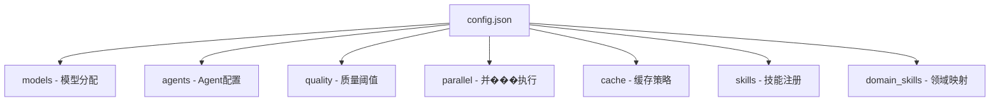

# config.json 配置参考

> **系统中心化配置文件** — 控制模型分配、质量阈值、并行执行、缓存策略和领域映射

---

## 一、配置概览

`config.json` 是论文工厂系统的核心配置文件，通过单文件控制整个论文生成流程的方方面面。



### 配置节速查表

| 配置节 | 作用 | 关键参数 |
|--------|------|----------|
| **models** | 定义推理/写作使用的模型类型 | `reasoning: opus`, `writing: sonnet` |
| **agents** | 12 个 Agent 的模型引用、工具权限、条件执行 | 每个 Agent 可定制模型、工具、激活条件 |
| **quality** | 质量门控阈值 | 最小论文字数、评审分数阈值、章节字数要求 |
| **parallel** | Phase 1 并行执行开关 | `phase1_enabled: true`, 超时重试机制 |
| **cache** | 论文缓存策略 | 自动生成索引、过期清理、领域映射 |
| **skills** | Skill 注册表 | 描述与 Skill 文件的映射关系 |
| **domain_skills** | 领域 → 评审专家的动态映射 | 基于 keywords 自动匹配 |

> **会议/期刊配置**：所有目标会议/期刊的配置信息（格式、页数限制、模板等）已从 `config.json` 迁移至项目根目录的 [venues.md](../venues.md) 文件。这是系统唯一的会议/期刊配置源，支持用户自定义添加新会议/期刊。详见 [快速开始指南](getting-started.md#第三步自定义会议期刊配置可选)。

---

## 二、models - 模型分配

定义系统中使用的模型类型，所有 Agent 通过引用这些名称来指定模型。

```json
"models": {
  "reasoning": "opus",
  "writing": "sonnet"
}
```

### 参数说明

| 参数 | 类型 | 默认值 | 说明 |
|------|------|--------|------|
| `reasoning` | string | `"opus"` | 推理类任务使用的模型（文献检索、评审、理论构建） |
| `writing` | string | `"sonnet"` | 写作类任务使用的模型（章节��写、格式整合） |

### 可用模型

| 模型 | 成本 | 适用场景 |
|------|------|----------|
| `opus` | 高 | 文献检索、同行评审、理论分析、工程分析 |
| `sonnet` | 中 | 章节撰写、格式整合、图表设计 |

### 修改指南

降低成本时，可将部分推理任务改用 Sonnet：

```json
"models": {
  "reasoning": "sonnet",  // 降低成本，但可能影响质量
  "writing": "sonnet"
}
```

---

## 三、agents - Agent 配置

定义 12 个 Agent 的模型引用、工具权限和条件执行逻辑。

### 配置结构

```json
"agents": {
  "a1": {
    "model": "reasoning",
    "tools": ["WebSearch", "WebFetch", "Read", "Write"]
  },
  "a2": {
    "model": "reasoning",
    "tools": ["Read", "Glob", "Grep", "Write", "Bash"],
    "conditional": true,
    "condition": "Project has a codebase_path to analyze"
  }
  }
```

### 参数说明

| 参数 | 类型 | 说明 |
|------|------|------|
| `model` | string | 引用 `models` 中定义的模型名称 |
| `tools` | array | Agent 可用的工具列表 |
| `conditional` | boolean | 是否为条件执行 Agent（可选） |
| `condition` | string | 激活条件的描述（可选） |

### 12 个 Agent 配置一览

| Agent | 模型引用 | 核心工具 | 条件执行 |
|-------|----------|----------|----------|
| **A1** 文献调研 | `reasoning` | WebSearch, WebFetch, Read, Write | - |
| **A2** 工程分析 | `reasoning` | Read, Glob, Grep, Write, Bash | 有 codebase_path |
| **A3** 理论构建 | `reasoning` | WebSearch, WebFetch, Read, Write | MAS 架构相关 |
| **A4** 创新形式化 | `reasoning` | Read, Write, Glob | - |
| **B1** 相关工作 | `reasoning` | Read, Write, WebSearch | - |
| **B2** 实验设计 | `reasoning` | Read, Write, Glob | - |
| **B3** 结构设计 | `reasoning` | Read, Write, Glob | - |
| **C1** 章节撰写 | `writing` | Read, Write | - |
| **C2** 图表设计 | `writing` | Read, Write | - |
| **C3** 格式整合 | `writing` | Read, Write, Glob | - |
| **D1** 同行评审 | `reasoning` | Read, Write | - |
| **D2** 修订执行 | `reasoning` | Read, Write | - |

### 修改示例

为 A1 文献调研降本：

```json
"a1": {
  "model": "writing"  // 从 reasoning 改为 writing
}
```

---

## 四、quality - 质量阈值

定义论文生成过程中的质量门控参数。

```json
"quality": {
  "min_papers": 40,
  "min_review_score": 9.0,
  "max_review_iterations": 15,
  "max_response_rounds": 3,
  "dynamic_scoring": true,
  "required_sections": ["abstract", "introduction", "related_work", "methodology", "experiments", "results", "discussion", "conclusion"],
  "section_min_word_count": {
    "introduction": 800,
    "related_work": 1500,
    "methodology": 1200,
    "experiments": 1000,
    "discussion": 800
  }
}
```

### 参数说明

| 参数 | 类型 | 默认值 | 说明 |
|------|------|--------|------|
| `min_papers` | int | 40 | Phase 1 最小检索论文数量 |
| `min_review_score` | float | 9.0 | 评审通过的最小分数（0-10 分制） |
| `max_review_iterations` | int | 15 | Phase 4 最大评审迭代次数 |
| `max_response_rounds` | int | 3 | 每轮迭代的专家回复轮数 |
| `dynamic_scoring` | boolean | true | 是否启用动态评分 |
| `required_sections` | array | - | 论文必含章节列表 |
| `section_min_word_count` | object | - | 各章节最小字数要求 |

### 章节字数要求

| 章节 | 最小字数 | 说明 |
|------|-----------|------|
| abstract | - | 由论文模板控制 |
| introduction | 800 | 引言 |
| related_work | 1500 | 相关工作（通常最长） |
| methodology | 1200 | 方法论 |
| experiments | 1000 | 实验设计 |
| results | - | 结果分析 |
| discussion | 800 | 讨论 |
| conclusion | - | 结论 |

### 修改指南

**收紧质量标准**（可能增加生成时间和成本）：

```json
"quality": {
  "min_papers": 60,           // 增加到 60 篇
  "min_review_score": 9.5,       // 提高到 9.5 分
  "max_review_iterations": 20     // 允许更多迭代
}
```

**放质量标准**（加快生成）：

```json
"quality": {
  "min_papers": 30,
  "min_review_score": 8.5,
  "max_review_iterations": 10
}
```

---

## 五、parallel - 并行执行

控制 Phase 1 的并行执行优化。

```json
"parallel": {
  "phase1_enabled": true,
  "use_task_tool": true,
  "timeout_per_agent": 300,
  "retry_on_failure": true,
  "max_retries": 1
}
```

### 参数说明

| 参数 | 类型 | 默认值 | 说明 |
|------|------|--------|------|
| `phase1_enabled` | boolean | true | 是否启用 Phase 1 并行模式 |
| `use_task_tool` | boolean | true | 是否使用 Task 工具实现并行 |
| `timeout_per_agent` | int | 300 | 单个 Agent 超时时间（秒） |
| `retry_on_failure` | boolean | true | 失败时是否重试 |
| `max_retries` | int | 1 | 最大重试次数 |

### 性能收益

| 模式 | Phase 1 执行时间 | 节省 |
|------|----------------|------|
| 串行模式 | 15-20 分钟 | - |
| 并行模式 | 8-12 分钟 | **40-60%** |

### 禁用并行模式

```json
"parallel": {
  "phase1_enabled": false  // 切换到串行模式
}
```

---

## 六、cache - 缓存策略

控制论文缓存系统的行为。

```json
"cache": {
  "enabled": true,
  "max_papers_per_domain": 500,
  "purge_after_days": 365,
  "auto_generate_index": true,
  "domains": {
    "multi_agent_systems": "MAS",
    "knowledge_graph": "KG",
    "nlp_to_sql": "NL2SQL",
    "bridge_engineering": "Bridge"
  }
}
```

### 参数说明

| 参数 | 类型 | 默认值 | 说明 |
|------|------|--------|------|
| `enabled` | boolean | true | 是否启用缓存系统 |
| `max_papers_per_domain` | int | 500 | 单领域最大缓存论文数 |
| `purge_after_days` | int | 365 | 缓存过期天数（0 = 不清理） |
| `auto_generate_index` | boolean | true | 是否自动生成索引文件 |
| `domains` | object | - | 领域代码映射表 |

### 领域映射表

| 领域标识 | 代码 | 缓存目录 |
|----------|------|----------|
| `multi_agent_systems` | MAS | `workspace/.cache/papers/MAS/` |
| `knowledge_graph` | KG | `workspace/.cache/papers/KG/` |
| `nlp_to_sql` | NL2SQL | `workspace/.cache/papers/NL2SQL/` |
| `bridge_engineering` | Bridge | `workspace/.cache/papers/Bridge/` |

### 性能收益

| 场景 | 无缓存 | 有缓存 |
|------|--------|--------|
| 首次生成 | 100% | 100% (建立缓存) |
| 第二次生成（同领域） | 100% | **20-40%** |
| 第三次生成（同领域） | 100% | **10-30%** |

---

## 七、skills - 技能注册

系统已安装 Skill 的描述和元数据。

```json
"skills": {
  "paper-generation": { "description": "论文生成主编排器" },
  "paper-phase1-research": { "description": "Phase 1 文献调研与工程分析" },
  "paper-phase2-design": { "description": "Phase 2 论文设计阶段" },
  "paper-phase3-writing": { "description": "Phase 3 论文撰写阶段" },
  "paper-phase4-quality": { "description": "Phase 4 质量保障阶段" },
  "research-mas-theory": { "domain": "multi_agent_systems", "output": "skill-mas-theory.json" },
  "research-kg-theory": { "domain": "knowledge_graph", "output": "skill-kg-theory.json" },
  "research-nlp-sql": { "domain": "nlp_to_sql", "output": "skill-nlp-sql.json" },
  "research-bridge-eng": { "domain": "bridge_engineering", "output": "skill-bridge-eng.json" },
  "domain-knowledge-prep": { "description": "领域知识准备" },
  "domain-knowledge-update": { "description": "领域知识动态更新" },
  "review-kg-domain": { "description": "Knowledge Graph 领域评审认知框架" },
  "review-mas-domain": { "description": "Multi-Agent Systems 领域评审认知框架" },
  "review-nl2sql-domain": { "description": "NL2SQL 领域评审认知框架" },
  "review-bridge-domain": { "description": "Bridge Engineering 领域评审认知框架" },
  "review-data-domain": { "description": "Data Analysis & ML 领域评审认知框架" },
  "review-se-domain": { "description": "Software Engineering 领域评审认知框架" },
  "review-hci-domain": { "description": "HCI 领域评审认知框架" }
}
```

---

## 八、domain_skills - 领域映射

定义领域与评审专家 Skill 的映射关系，实现动态专家选择。

```json
"domain_skills": {
  "knowledge_graph": {
    "skill": "review-kg-domain",
    "full_name": "Knowledge Graphs and Ontology Engineering",
    "keywords": ["KG", "ontology", "RDF", "OWL", "SPARQL", "knowledge graph", "RDFS"]
  },
  "multi_agent_systems": {
    "skill": "review-mas-domain",
    "full_name": "Multi-Agent Systems (MAS)",
    "keywords": ["multi-agent", "MAS", "BDI", "Contract Net", "Blackboard", "agent communication", "coordination", "negotiation"]
  },
  "nl2sql": {
    "skill": "review-nl2sql-domain",
    "full_name": "Natural Language to SQL (NL2SQL / Text2SQL)",
    "keywords": ["NL2SQL", "Text2SQL", "schema linking", "SQL generation", "text-to-SQL", "natural language interface"]
  },
  "bridge_engineering": {
    "skill": "review-bridge-domain",
    "full_name": "Bridge Engineering",
    "keywords": ["bridge", "structural health", "inspection", "BIM", "SHM", "non-destructive testing", "load rating", "damage detection"]
  },
  "data_analysis": {
    "skill": "review-data-domain",
    "full_name": "Data Analysis and Machine Learning",
    "keywords": ["data mining", "machine learning", "classification", "regression", "clustering", "feature engineering", "cross-validation"]
  },
  "software_engineering": {
    "skill": "review-se-domain",
    "full_name": "Software Engineering",
    "keywords": ["software engineering", "software development", "DevOps", "MLOps", "agile", "CI/CD", "testing", "code quality"]
  },
  "human_computer_interaction": {
    "skill": "review-hci-domain",
    "full_name": "Human-Computer Interaction",
    "keywords": ["HCI", "user experience", "UX", "interface design", "usability", "user studies", "interaction design"]
  }
}
```

### 参数说明

| 参数 | 类型 | 说明 |
|------|------|------|
| `skill` | string | 对应的评审 Skill 名称 |
| `full_name` | string | 领域完整名称 |
| `keywords` | array | 匹配关键词列表 |

### 工作原理

Phase 4 执行时，系统会：
1. 读取 `input-context.md` 中的论文内容
2. 匹配 `keywords` 判断论文所属领域
3. 动态加载对应的 `review-*-domain` Skill 作为评审专家

### 新增领域

```json
"domain_skills": {
  "your_new_domain": {
    "skill": "review-your-domain",
    "full_name": "Your New Domain Full Name",
    "keywords": ["keyword1", "keyword2", "keyword3"]
  }
}
```

---

## 九、常见配置场景

### 场景 1：降低成本

将所有推理任务改用 Sonnet：

```json
"models": {
  "reasoning": "sonnet",
  "writing": "sonnet"
}
```

### 场景 2：提高质量

增加文献检索量和评审标准：

```json
"quality": {
  "min_papers": 60,
  "min_review_score": 9.5,
  "max_review_iterations": 20
}
```

### 场景 3：禁用缓存

```json
"cache": {
  "enabled": false
}
```

### 场景 4：禁用并行模式

```json
"parallel": {
  "phase1_enabled": false
}
```

### 场景 5：新增评审领域

1. 创建 `review-your-domain/SKILL.md`
2. 在 `domain_skills` 中添加映射
3. 在 `skills` 中注册元数据

---

## 十、注意事项

1. **修改后重启**：修改配置后需要重新启动 Claude Code 才能生效
2. **JSON 格式**：确保 JSON 格式正确，否则系统无法启动
3. **Git 追踪**：建议将配置修改纳入 Git 追踪
4. **成本平衡**：降低模型级别可能影响输出质量
5. **超时设置**：`timeout_per_agent` 过短可能导致 Agent 被强制终止

---

**最后更新**: 2026-02-14
